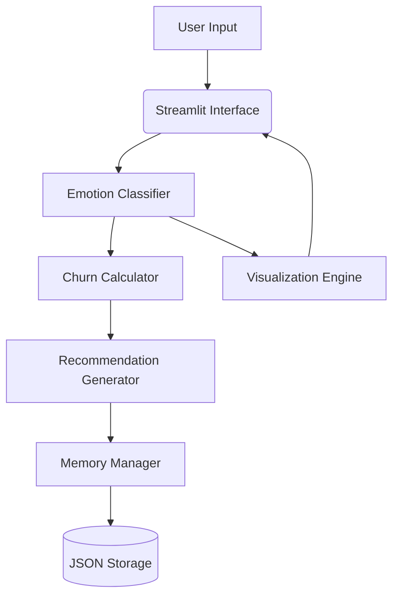

# Emotion Retention Assistant
## 🔍 Overview
The Emotion Retention Assistant is a Streamlit-based application that combines Natural Language Processing (NLP) with conversational memory management to:
1. Analyze user emotions from text inputs
2. Predict retention risk using emotional patterns
3. Generate personalized response recommendations
4. Visualize emotional metrics through interactive dashboards

## ✨ Key Features
| Feature | Technology | Benefit |
|---------|------------|---------|
| Real-time emotion classification | DistilRoBERTa model | Accurate multi-label emotion detection |
| Churn risk prediction | Negative emotion aggregation | Proactive retention management |
| AI-generated recommendations | GPT-2 text generation | Context-aware response strategies |
| Persistent conversation memory | LangChain + JSON storage | Continuous context preservation |
| Interactive visualizations | Matplotlib | Intuitive emotional insights |

## 📦 System Architecture


## 📦 Installation

### 1. Clone the repository

```bash
git clone <repository_url>
cd <repository_directory>
```

#### 2. Install the dependencies

```bash
pip install -r requirements.txt
```

