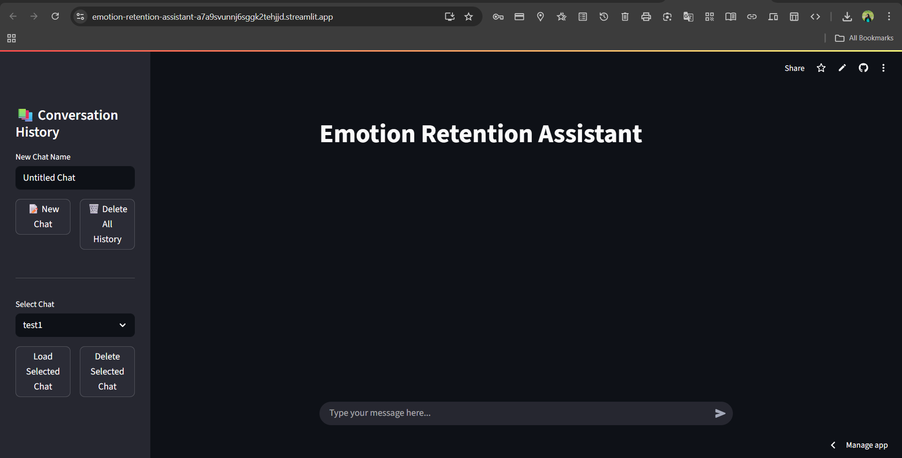

# Emotion Retention Assistant
## Overview
The Emotion Retention Assistant is a Streamlit-based application that combines Natural Language Processing (NLP)
with conversational memory management to:
1. Analyze user emotions from text inputs
2. Predict retention risk using emotional patterns
3. Generate personalized response recommendations
4. Visualize emotional metrics through interactive dashboards
## Key Features
| Feature | Technology | Benefit |
|-----------------------------|--------------------------|--------------------------------------|
| Real-time emotion classification | DistilRoBERTa model | Accurate multi-label emotion detection |
| Churn risk prediction | Negative emotion aggregation | Proactive retention management |
| AI-generated recommendations | GPT-2 text generation | Context-aware response strategies |
| Persistent conversation memory | LangChain + JSON storage | Continuous context preservation |
| Interactive visualizations | Matplotlib | Intuitive emotional insights |
## System Architecture
## Installation
### 1. Clone the repository
```bash
git clone <repository_url>
cd <repository_directory>
```
### 2. Install the dependencies
```bash
pip install -r requirements.txt
```

## Usage Guide
### 3. Launch the application
```bash
streamlit run main.py
```
### Interface Overview

*Figure: Main application interface showing conversation history sidebar and chat area*

Component | Functionality
--------- | -------------
Main Chat Area | Displays conversation history with analysis
Input Box | Message entry at bottom of screen
Sidebar | Conversation management controls
Expandable Panels | Detailed emotion and risk visualizations
### Workflow
## 🔄 Workflow Process

```mermaid
graph TD
    A[📥 Enter Customer Message] --> B{Processing Engine}
    B --> C[🧠 Emotion Detection]
    B --> D[⚠️ Churn Risk Calculation]
    B --> E[💡 Recommendation Generation]
    C --> F["**Primary Emotion**:<br>anger/joy/sadness..."]
    D --> G["**Churn Risk**:<br>0-100%"]
    E --> H["**Retention Recommendation**"]
    F --> I[📊 Expand Analytics]
    G --> I
    H --> I
    I --> J[📈 Emotion Distribution]
    I --> K[🔍 Risk Assessment]
```


- Enter customer message in chat input
- Application returns:
 - Primary detected emotion
 - Churn risk percentage
 - AI-generated retention recommendation
- Expand panels to view detailed emotion distribution and risk assessment
### Conversation Management
Action | Method | Data Persistence
------ | ------ | ----------------
New Conversation | Sidebar: "New Chat" | Creates new chat_history.json
Archive Chat | Automatic on new chat start | Saves to archived_chats.json
Restore Conversation | Sidebar: "Load Selected" | Retrieves from archived_chats.json
Delete History | Sidebar: "Delete All" | Clears all JSON files
## Technical Specifications
### AI Models
Model | Purpose | Specifications
----- | ------- | --------------
j-hartmann/emotion-english-distilroberta-base | Emotion classification | 7 emotional categories, DistilRoBERTa
architecture
gpt2 | Recommendation engine | 117M parameters, fine-tuned for retention strategies
### Core Algorithms
# Emotion Detection
def detect_emotion(text):
 results = classifier(text)[0]
 return sorted(results, key=lambda x: x['score'], reverse=True)
# Churn Risk Calculation
def calculate_churn_percent(scores):
 risk_emotions = ['anger', 'disgust', 'fear', 'sadness']
 return sum(score['score'] for score in scores
 if score['label'].lower() in risk_emotions) * 100
# Recommendation Engine
def recommend_action(emotion, user_message):
 prompt = f"Generate retention response for: {user_message} with emotion {emotion}"
 return generator(prompt, max_length=100)[0]['generated_text']
### Data Persistence
File | Structure | Purpose
---- | --------- | -------
chat_history.json | List of message objects | Current conversation
archived_chats.json | List of {name, chat} objects | Historical conversations
### Visualization System
Visualization | Type | Color Coding
------------- | ---- | -------------
Emotion Distribution | Horizontal Bar Chart | Emotion-specific palette
Churn Risk | Single Bar Meter | Gradient (green red)
